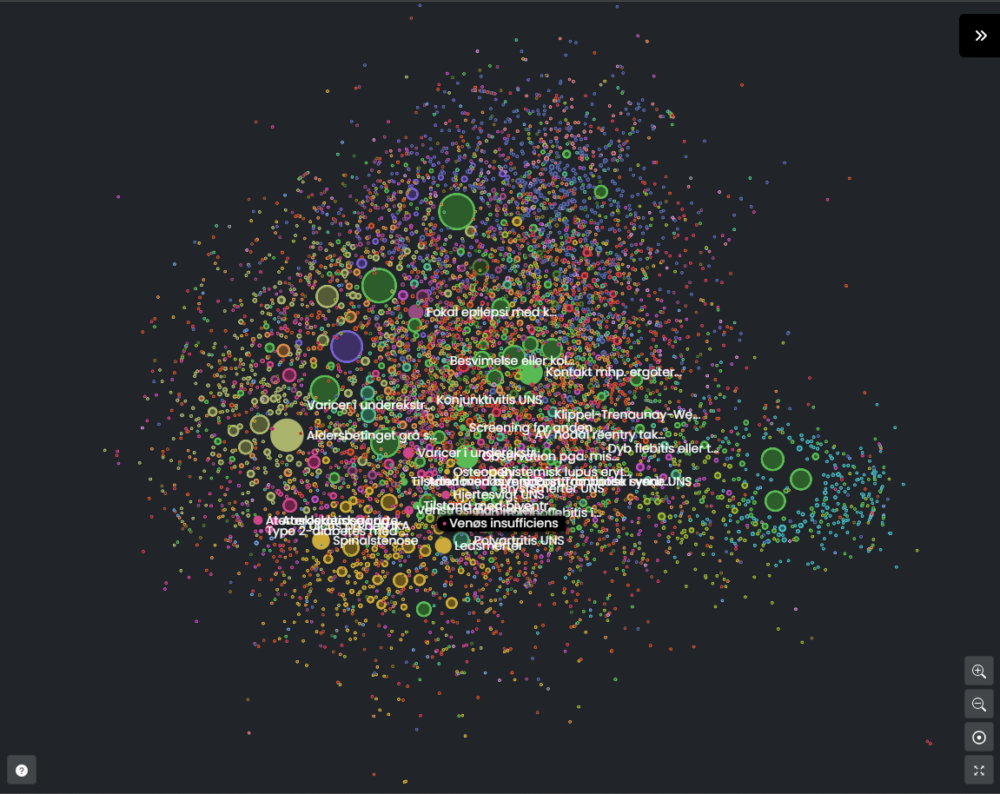

# FA2A-Case-Rigshospitalet

Hent selv datasættet fra Gitlab jf. opslaget på Learn. 

I kan også prøve at uploade network_analysis.gexf på Gephi Lite: https://gephi.org/gephi-lite/
For at få grafen på billedet network.png skal man bruge ForceAtlas2 som layout algoritme, farvelægge nodes ud fra deres Gruppe 1 attribute og lade deres størrelse afhænge af deres degree (med størrelser fra 10 til 100):

